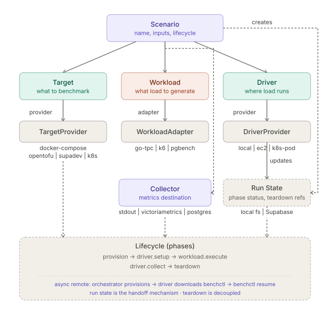

# Concepts

## Scenario structure

A scenario is a YAML file that defines a benchmark along four orthogonal axes:

| Axis | What it describes | Examples |
|---|---|---|
| **Target** | Database under test | `docker-compose`, `opentofu`, `supabase` |
| **Workload** | Load to generate | `go-tpc`, `k6`, `shell` |
| **Driver** | Where the load generator runs | `local`, `ec2` |
| **Collector** | Where results go | `stdout`, `victoriametrics` |

benchctl calls providers and adapters as executables; it delegates to docker-compose, opentofu, and Kubernetes rather than reimplementing them. The YAML describes *what* you want; providers handle *how*.

## Run lifecycle

Every scenario execution is a **run**, tracked by a run ID through a fixed sequence of phases:

```
provision → driver.setup → workload.execute → driver.collect → teardown
```

Teardown always runs in reverse order, driver first and then target, even when an earlier phase fails.

## Domain model



## Scenario YAML reference

```yaml
apiVersion: bench/v1
kind: Scenario
metadata:
  name: postgres-tpcc-local
  labels:
    engine: postgres
    workload: tpcc

# Inputs let callers parameterize the scenario at runtime with --set.
inputs:
  warehouses: { type: int,      default: 1    }
  threads:    { type: int,      default: 2    }
  duration:   { type: duration, default: 1m   }
  collector:  { type: string,   default: stdout }

target:
  provider: docker-compose
  config:
    services:
      - name: postgres
        definition: ./services/postgres/docker-compose.yml
        vars:
          image: "postgres:17"
          user: bench
          password: bench
          db: tpcc

# A suite lists benchmarks; each benchmark lists the steps to run in order.
suite:
  benchmarks:
    - name: postgres
      using: postgres          # a service name from target.config.services
      steps:
        - name: get-pg-version
          type: metadata
          command: sql
          args:
            name: pg_version
            query: "SELECT version()"
        - name: prepare-warehouses
          type: go-tpc
          command: prepare
          args:
            warehouses: "{{ inputs.warehouses }}"
        - name: benchmark
          type: go-tpc
          command: run
          args:
            warehouses: "{{ inputs.warehouses }}"
            threads:    "{{ inputs.threads }}"
            time:       "{{ inputs.duration }}"

driver:
  provider: local

# collector.provider can reference an input to make it switchable at runtime.
collector:
  provider: "{{ inputs.collector }}"
```

## Template variables

Values in a scenario YAML can reference:

| Expression | Resolves to |
|---|---|
| `{{ inputs.<name> }}` | Resolved input value (default or `--set` override) |
| `{{ target.outputs.<key> }}` | Output from the target provider (e.g. host, port) |

## Inputs

Override any input at runtime with `--set`:

```bash
./benchctl run scenario.yaml --set warehouses=50 --set duration=30m
```

Supported types: `int`, `string`, `duration`, `bool`, `list`.

Run `benchctl info scenario.yaml` to list a scenario's declared inputs (with their type, current
value, and whether they're required) along with its fixtures and benchmark steps, without running
it. Add `--set` to preview the effect of an override, for example on a fixture's resolved values,
before committing to a run.

## Run metadata

A `type: metadata` step records one value under `args.name`. benchctl shows these values under `Metadata` in `benchctl status <run-id>` and pushes them to the state store after `driver.collect` completes. The step's `command` selects what to record:

- `sql` (the default) runs `args.query` and records the single value it returns.
- `rtt` times network round trips from the driver instance to the target, in microseconds. Use it as a colocation check.

```yaml
- name: network-rtt-baseline
  type: metadata
  command: rtt
  args:
    name: network_rtt
```

## Collector

Pass `--set collector=victoriametrics` at runtime to push metrics to VictoriaMetrics instead of printing them:

```bash
./benchctl run scenarios/postgres-tpcc-local.yaml --set collector=victoriametrics
```

See [metrics.md](metrics.md) for configuration details.

## Fixtures

Fixtures run a benchmark over the Cartesian product of parameter values, so a single scenario file can sweep client counts, dataset sizes, or protocol variants. See [fixtures.md](fixtures.md).
